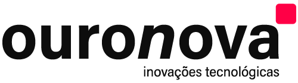

## FullStack Test - Luigi Gontijo

Este teste foi realizado para a vaga de FullStack Developer na empresa ****(https://ouronova.com/empresa/).

Fora considerado o tempo de 3 dias para a realização do teste, a resposta segue o padrão do teste.

O teste foi realizado auxílo de consulta em documentações e pesquisas na internet.

As respostas servem também como uma documentação para uma consulta futura, e para facilitar o curto entendimento de python e django.

Liguagens e conceitos abordados no teste:

- Python
- Django
- HTML
- CSS
- JavaScript

## Respondido em português

Esta versão de respostas foi respondida em português, como a vaga é para o Brasil, acredito que seja mais adequado.

## 📚 FrontEnd Test Answers

1. Q&A FrontEnd test
2. Practical FrontEnd test.

---

## 📚 BackEnd Test Answers

1. Q&A BackEnd test
2. Practical BackEnd test.

